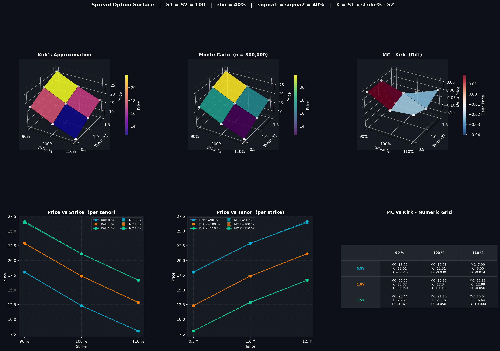
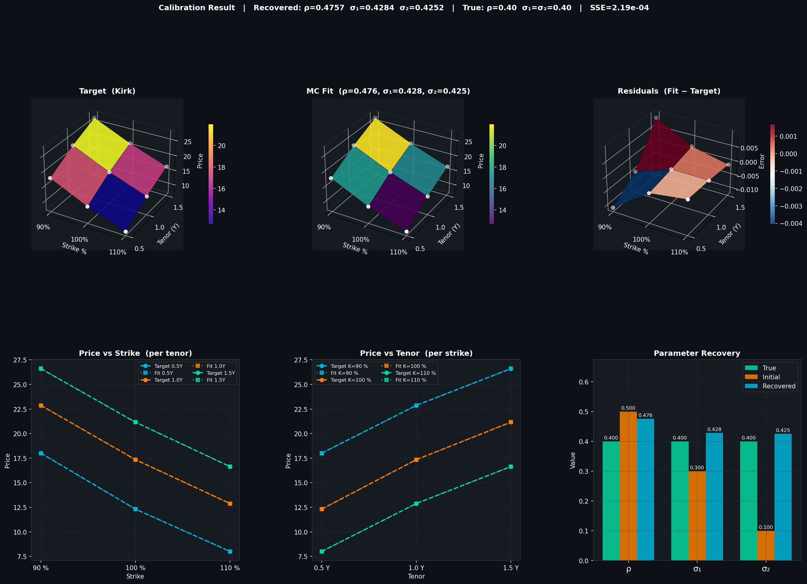

# MC Calibration — Spread Option Surface

Prices a **spread option** `max(S₁ − S₂ − K, 0)` using two methods — **Kirk's (1995) closed-form approximation** and **Monte Carlo simulation** — then calibrates `σ₁`, `σ₂`, and `ρ` back from the Kirk surface using two optimisation approaches:

1. **§7 — Differential Evolution** (global, gradient-free)
2. **§8 — Sobol QMC + IPA Gradients + Levenberg-Marquardt** (local, analytic gradients, ~20–50× faster)

---

## Overview

| Component | Description |
|---|---|
| **Kirk's Approximation** | Closed-form spread option pricer (Kirk, 1995). Treats `(S₂ + K)` as a single log-normal proxy asset, reducing to a standard Black call. |
| **Monte Carlo Pricer** | Single-step GBM with 300 000 paths. Correlated normals via Cholesky decomposition. |
| **3×3 Surface** | Prices computed across 3 tenors × 3 strikes for both methods. |
| **DE Calibration (§7)** | `scipy.optimize.differential_evolution` — population-based global search. ~200s, ~1 800 evaluations. |
| **Fast Calibration (§8)** | Sobol QMC (50k paths) + pathwise IPA gradients + `scipy.optimize.least_squares` (Trust Region Reflective). ~2–5s, ~10–15 evaluations. |

---

## Parameters

| Parameter | Default | Description |
|---|---|---|
| `S1` | 100 | Spot price of asset 1 |
| `S2` | 100 | Spot price of asset 2 |
| `TENORS` | 0.5Y, 1.0Y, 1.5Y | Option maturities |
| `STRIKES` | −10, 0, +10 | Absolute spread strikes (= S1·k% − S2) |
| `sig1` (init) | 30% | Initial guess for σ₁ in calibration |
| `sig2` (init) | 10% | Initial guess for σ₂ in calibration |
| `rho` (init) | 0.5 | Initial guess for correlation ρ |
| `N_SIMS` | 300 000 | Monte Carlo paths (surface) |
| `N_SOBOL` | 50 000 | Sobol QMC paths (fast calibration) |

---

## Files

```
.
├── spread_option_surface.ipynb       # Main notebook (23 cells)
├── spread_option_surface.png         # 3D Kirk vs MC surface plot
├── spread_option_calibration.png     # DE calibration fit plot
├── spread_option_fast_calib.png      # DE vs LM comparison plot
├── project_log_2026-03-12.txt        # Full session log
└── README.md
```

---

## Notebook Structure

| Section | Content |
|---|---|
| §1 | Imports (`numpy`, `matplotlib`, `scipy`) |
| §2 | Parameters |
| §3 | `kirk_price()` — Kirk (1995) closed-form |
| §4 | `mc_price()` — Monte Carlo pricer |
| §5 | Populate 3×3 surface (Kirk + MC) |
| §6 | 3D surface visualisation |
| §7 | Calibration: DE optimiser recovers `σ₁`, `σ₂`, `ρ` |
| §8 | **Fast calibration: Sobol + IPA + Levenberg-Marquardt** |

---

## Quickstart

```bash
pip install numpy scipy matplotlib
```

```
jupyter notebook spread_option_surface.ipynb
# Kernel → Restart & Run All
```

---

## Method Notes

### Kirk's Approximation
Let `w = F₂ / (F₂ + K)` and `σ_eff = √(σ₁² − 2ρσ₁σ₂w + σ₂²w²)`.
The spread option price reduces to a standard Black call with forward `F₁/(F₂+K)` and strike 1.

### Monte Carlo
Correlated log-normal paths:
```
Z₂ = ρ·Z₁ + √(1−ρ²)·Z_indep
S_T = S · exp((r − ½σ²)T + σ√T · Z)
payoff = max(S₁_T − S₂_T − K, 0)
```

### Calibration §7 — Differential Evolution
Population-based global search minimising SSE between `mc_surface(σ₁, σ₂, ρ)` and the Kirk target surface. Pre-drawn pseudorandom normals make the objective deterministic.
- Bounds: `σ₁, σ₂ ∈ [1%, 100%]`, `ρ ∈ [−0.999, 0.999]`
- Typical: ~200s, ~1 800 evaluations, 500k paths/eval

### Calibration §8 — Sobol + IPA + Levenberg-Marquardt

Three improvements for ~20–50× speedup:

1. **Sobol quasi-random sequences** — `O(1/N)` convergence vs `O(1/√N)` pseudorandom. 50k Sobol ≈ 500k pseudorandom.

2. **Pathwise (IPA) sensitivities** — exact analytic gradients through the MC paths at zero extra cost:
   ```
   ∂price/∂σ₁ = E[ 1{ITM} · S₁_T · (−σ₁T + √T·Z₁) ]
   ∂price/∂σ₂ = E[ 1{ITM} · (−S₂_T · (−σ₂T + √T·Z₂)) ]
   ∂price/∂ρ  = E[ 1{ITM} · (−S₂_T · σ₂√T · ∂Z₂/∂ρ) ]
   ```

3. **Levenberg-Marquardt** (Trust Region Reflective) — nonlinear least-squares with the analytic 9×3 Jacobian. Converges in ~10–15 iterations.

---

## Output






